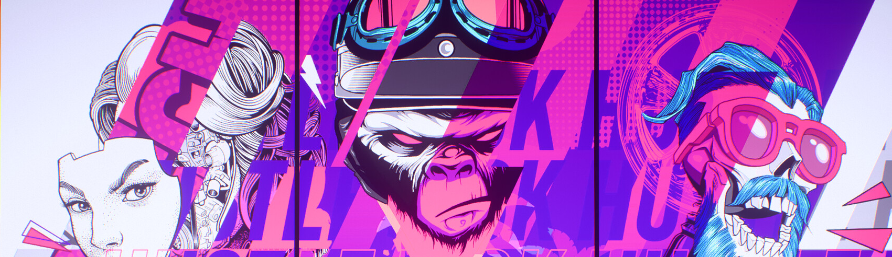
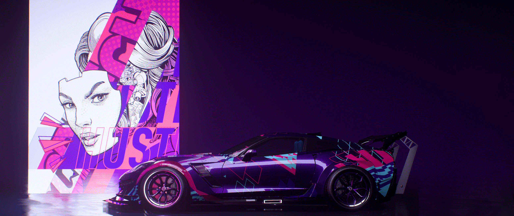

### Hey there 👋

<!--
**Thisisguillermo/Thisisguillermo** is a ✨ _special_ ✨ repository because its `README.md` (this file) appears on your GitHub profile.

Here are some ideas to get you started:

- 🔭 I’m currently working on ...
- 🌱 I’m currently learning ...
- 👯 I’m looking to collaborate on ...
- 🤔 I’m looking for help with ...
- 💬 Ask me about ...
- 📫 How to reach me: ...
- 😄 Pronouns: ...
- ⚡ Fun fact: ...
-->

<!-- I am Guillermo and currently I'm learning Front-end web development and this read me is under construction. -->

# **Hello! I am Guillermo Zaandam**
---

## **EA TRAXX**

<!--  -->

---

I am passionate about car technology, software engineering and more. You can find more at https://guillermozaandam.nl Feel free to browse my repositories. Names can be weird or sometimes the name doesn't show what's inside the project.

